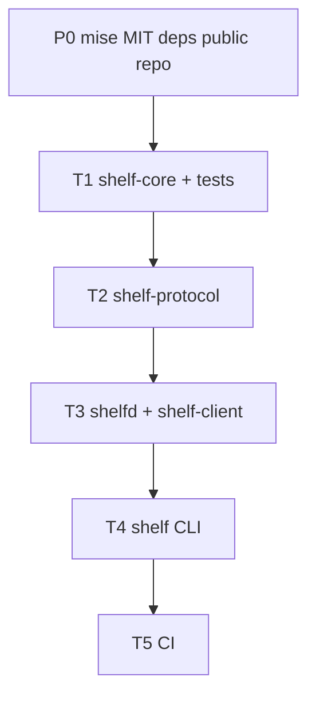

# Orchestration plan: Shelf core wave

## Problem / end state

Empty workspace becomes a compiling, tested first slice: `shelf-core` types + tests, `shelf-protocol` envelopes, `shelfd` local IPC, `shelf` CLI, and CI (`fmt`, `clippy -D warnings`, `test`).

## Base branch policy

`BASE` = `main` (renamed from `master` at skill start). Each task branches from `BASE` after prior wave merges.

## DAG overview

## Model / subagent-type

User override: all executable tasks use `generalPurpose` + `cursor-grok-4.6-high` in isolated worktrees (`best-of-n-runner`). Parent reviews and merges.

## Merge / validation order

P0 (parent) → T1 → T2 → T3 → T4 → T5. Do not launch a dependent until its predecessor is merged into `main`.
