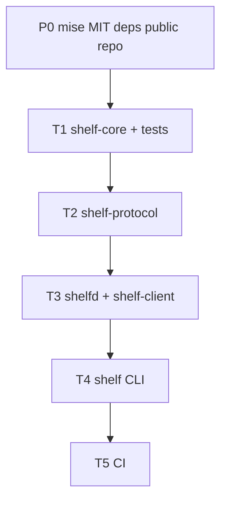

# Orchestration plan: Shelf core wave

## Problem / end state

Empty workspace becomes a compiling, tested first slice: `shelf-core` types + tests, `shelf-protocol` envelopes, `shelfd` local IPC, `shelf` CLI, and CI (`fmt`, `clippy -D warnings`, `test`).

## Base branch policy

`BASE` = `main` (renamed from `master` at skill start). Each task branches from `BASE` after prior wave merges.

## DAG overview

## Model / subagent-type

User override: all executable tasks use `generalPurpose` + `cursor-grok-4.6-high` in isolated worktrees (`best-of-n-runner`). Parent reviews and merges.

## Merge / validation order

P0 (parent) → T1 → T2 → T3 → T4 → T5. Do not launch a dependent until its predecessor is merged into `main`.

## Per-task handoff packets

### Task `T1`: shelf-core + tests
- **Problem:** Core types and invariants are specified in docs but the crate is an empty scaffold.
- **Solution:** Implement modules matching `docs/ARCHITECTURE.md` crate tree; tests lock design invariants; no daemon/CLI/protocol work.
- **Implement:** See agent prompt. Key docs: `docs/DESIGN.md`, `docs/ENROLLMENT.md`, `docs/ENCRYPTION.md`, `docs/INDEX.md`.
- **End state:** `cargo test -p shelf-core`, `cargo clippy -p shelf-core --all-targets -- -D warnings`, `cargo fmt --all --check` pass. Public types documented. Exhaustive switches.
- **Depends on:** P0 (merged)
- **Subagent type / model:** generalPurpose-equivalent in worktree / cursor-grok-4.6-high
- **Effort / scope bound:** Only `crates/shelf-core/**`. No transports, mailbox, GUI, IPC.
- **Return:** summary, diff stats, test commands+results, risks

### Task `T2`: shelf-protocol envelopes
- **Problem:** Wire/storage envelopes are specified but unimplemented.
- **Solution:** Versioned `EncryptedObject`, AEAD encrypt/decrypt with XChaCha20-Poly1305, AAD binding, algorithm IDs.
- **Implement:** `crates/shelf-protocol/**` using `shelf-core` types. Tests for encrypt/decrypt, AAD mismatch, versioning.
- **End state:** `cargo test -p shelf-protocol` and clippy `-D warnings` pass.
- **Depends on:** T1
- **Subagent type / model:** worktree / cursor-grok-4.6-high
- **Effort / scope bound:** Protocol crate only. No daemon/CLI. No mailbox API.
- **Return:** summary, diff stats, tests, risks

### Task `T3`: shelfd + shelf-client IPC
- **Problem:** Clients must talk to a local daemon over UDS (macOS/Linux).
- **Solution:** JSON IPC for put/ls/latest/get; in-memory or sqlite-backed store; `shelfd` listen loop; `shelf-client` connector.
- **Implement:** `apps/shelfd`, `crates/shelf-client`. Socket under a test-overridable runtime dir (not hardcoded production-only).
- **End state:** Integration test: spawn daemon (or in-process server), put, latest, ls, get. clippy `-D warnings`.
- **Depends on:** T2
- **Subagent type / model:** worktree / cursor-grok-4.6-high
- **Effort / scope bound:** No Tailscale/LAN/mailbox. No GUI. Windows named pipes can be a typed stub.
- **Return:** summary, diff stats, tests, risks

### Task `T4`: shelf CLI
- **Problem:** Documented `shelf` commands do not exist.
- **Solution:** clap binary `shelf` with put/latest/ls/get/pin/rm matching `docs/DESIGN.md`; stdin/stdout first-class.
- **Implement:** `apps/shelf-cli` `[[bin]] name = "shelf"`. Talks to shelfd via shelf-client.
- **End state:** CLI tests or `trycmd`/assert_cmd against a test daemon. `shelf --help` lists documented verbs.
- **Depends on:** T3
- **Subagent type / model:** worktree / cursor-grok-4.6-high
- **Effort / scope bound:** No enroll/devices/scratch UI. No shelf-copy/shelf-paste aliases unless cheap.
- **Return:** summary, diff stats, tests, risks

### Task `T5`: CI
- **Problem:** No CI job for fmt/clippy/test.
- **Solution:** GitHub Actions on push/PR: rust-toolchain 1.98.0, fmt, clippy `-D warnings`, test workspace.
- **Implement:** `.github/workflows/ci.yml`
- **End state:** Workflow file valid; local same commands green on `main`.
- **Depends on:** T4
- **Subagent type / model:** worktree / cursor-grok-4.6-high
- **Effort / scope bound:** CI only. No extra linters.
- **Return:** summary, workflow path, local command results
